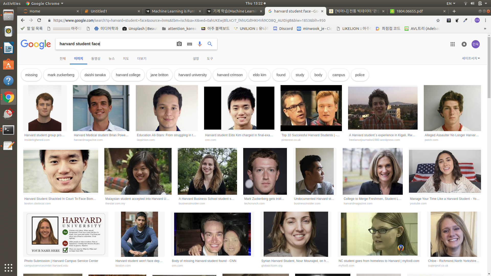
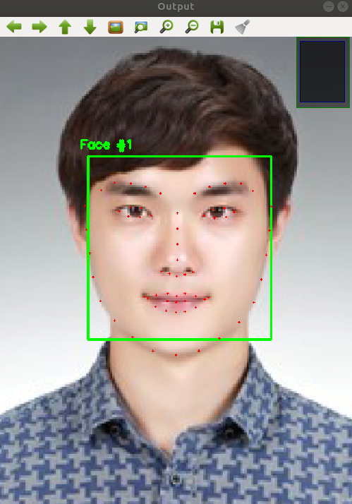
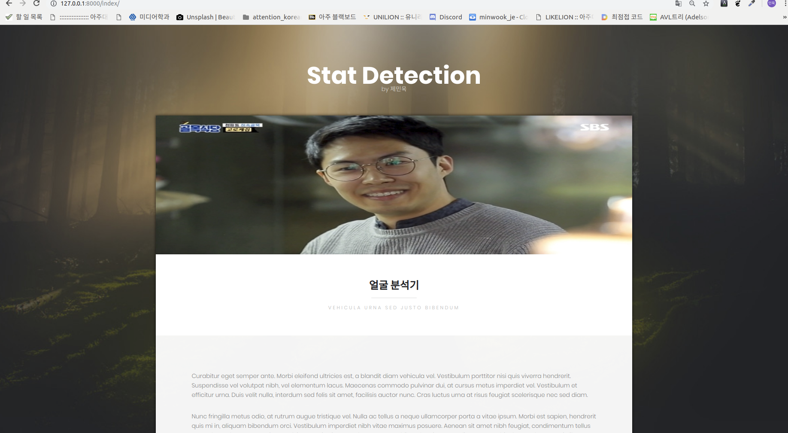

# 1.**Deep learning model**

> 딥러닝 모델을 만든다.

## Step 0: Data Crawling

### Domain
- 지력:professor
- 호감도: actor + celebrity
- 성실성: sports(man+woman)
- 카리스마: politician
- 절제력: -(criminal)

 5가지 domain에 맞추어 Google에서 type=”face”, keyword=”domain”으로 검색을 한다.

 각 도메인당 600개의 사진 데이터를 구한다.

c.f) 만약 남,여를 구분할 경우에는 남자와 여자 군집 각 600개씩 데이터를 구한다.

## Step 1 : Facial Feature Detection
### 1.Data normalization

- 3000(600*5)장의 사진에서 얼굴만을 추출한다.(머리카락, 옷등의 변수를 최대한 배제)
- 600*600으로 사이즈를 통일한다.
- 조명과 색상의 영향을줄이기 위하여 모두 grey_scale로 색상을 변환하여준다.(이미지 사이즈 절감 효과)

### 2.Facial landmark detection
openCV 라이브러리에 있는 메소드들을 통하여 이미지로부터 68가지의 landmark points(눈,코,입,턱선,눈썹,인중,콧구멍등)를 추출한다. 

## Step 2 : Coordinate Transformation
(600,600) X,Y좌표값을 조정해준다.

## Step 3 : Face Alignment
오른쪽 ,왼쪽 눈을 기준으로 얼굴을 가운데 정렬해준다.
(180,600) (420,200) =( 0.3 x width, height / 3 ) and ( 0.7 x width , height / 3 )

사용기술: 
- “Delaunay Triangulation”

## Step 4 : Average Face
각 도메인에 맞는 기준점을 만들어주기 위하여, 각 카테고리별로 평균적인 얼굴((x,y)*68)값을 구해준다.
이후  도메인에 맞는 얼굴일 경우에는 true값을 (,true)*600 평범한 얼굴일 경우에는 (,false)*600장 값을 넣어준다.

그 뒤, .shuffle()을 하여 우리가 생성할 model의 x값으로 넣어준다.
* (600() ,true)  : 도메인에 부합하는 사진 600장
* (600() ,false):  도메인에 부합하지 않는 사진(일반인 사진) 600장

## Step 5: CNN model
평균 얼굴과 평범한 얼굴 사이의 distance를 구하고 이를 max할 수 있는 
linear function을 구한다. 이러한 모델을 5가지 만들고  sigmoid()를 통하여 0~1사이의 평균값을 구한다.

결과적으로 5가지  카테고리에 부합되는 확률값이 계산이 된다. 

c.f)CNN을 통하여 모델링을 할 경우에는 다른 방식으로 data preprocessing을 해주어야 하기 때문에, 다음 계획에서 처리하도록 합니다. 

# 2.**WEB**

> Django를 활용하여 서비스를 제공할 웹페이지를 생성한다.
-------------------------------------------------------------------------------------------
## 전반적인 계획
- Django(python web framework)를 활용하여 웹 서비스를 제공한다.
- Keras를 통하여 User가 upload한 image 파일을 분석한 뒤, 시각화 페이지에서 stat을 시각화 한다.

## 구현해야 하는 기능
- Input
    - User의 사진을 upload 하는 기능
    - Upload된 이미지를 저장 할 수 있는 database(model in MTV model)
    
- Output
    - Analized data from keras model
    - Visualizing with sth beautiful

## 페이지별 분류 

- Main page: 프로젝트의 목적을 알린다.
    
- Upload page: 
    - 유저의 기본적인 인적사항을 적을 수 있는 페이지(시간이 남는다면 사주팔자 구현)
    - 유저의 사진을 올릴 수 있는 페이지
    - 데이터 분석하는 동안 loading .gif를 보여주도록 한다.
    
 - result page:
    - 유저의 사진과 분석에 주로 사용된 부위를 highlight
    - 사진 옆에는 6가지 stat에 대한 확률을 6각형 도표로 보여준다.
    - 해당 6가지 stat에 대한 유사한 유명인 사진을 보여준다.
    
 ## 진행사항
 
1. [장고철학](https://github.com/minkj1992/Djago/blob/master/Basic-0-0-Django.md)
2. [장고 setting](https://github.com/minkj1992/Djago/blob/master/Basic-0-1-Setting.md)
3. [terminal command for Django](https://github.com/minkj1992/Djago/blob/master/Basic-0-2-Cheat_sheet.md)
4. [Hello World](https://github.com/minkj1992/Djago/blob/master/Basic-1-1-Hello_World.md)
5. [MTV pattern](https://github.com/minkj1992/Djago/blob/master/Basic-1-2-MVT_Pattern.md)
6. [first dump prject](https://github.com/minkj1992/Djago/blob/master/Basic-2-1-word_counter1.md)
7. [first dump prject2](https://github.com/minkj1992/Djago/blob/master/Basic-2-2-Word_counter2.md)
8. [first dump prject3](https://github.com/minkj1992/Djago/blob/master/Basic-2-3-Word_counter3.md)
9. [free Html5 with Django](https://github.com/minkj1992/Djago/blob/master/Django_Html5_templates.md)

## 공부할 사항
1. 이미지 업로드 page 구현
2. view에서 업로드한 이미지 데이터베이스 저장법.
3. keras 모델과 Django 연동 

    
